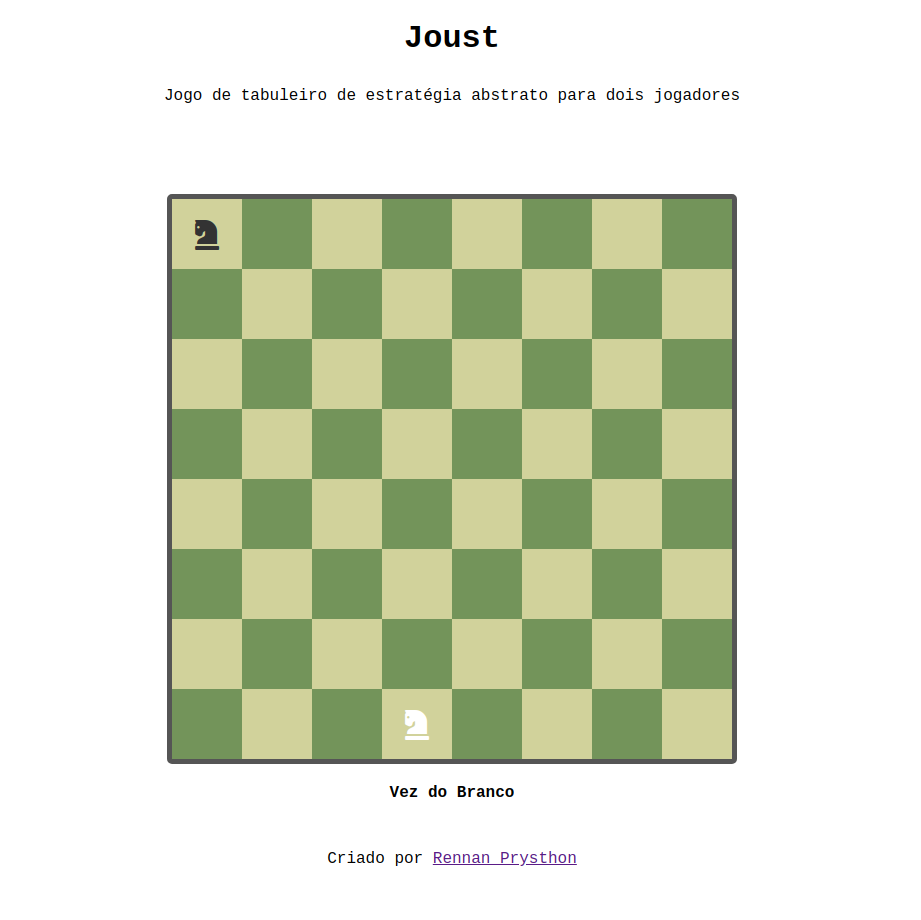

# Jous

## jogo de tabuleiro de estratégia abstrato para dois jogadores

> o jogo foi implementado com html, css e javascript puro

Joust é um jogo de tabuleiro de estratégia abstrato para dois jogadores que pode ser considerado
uma variante para dois jogadores do tour do cavalo. Também pode ser considerada uma variante
do xadrez.
Ele usa um tabuleiro de xadrez de 8 × 8 e dois cavalos do jogo de xadrez como
as únicas peças do jogo. Cada jogador tem um cavalo de uma cor diferente e jogam de forma
alternada. Os cavalos movem-se como no jogo de xadrez, mas o quadrado que o cavalo sai (ao
fazer um movimento) fica “queimado”, ou seja, nenhum cavalo pode ser movido para este quadrado.
Conforme o jogo avança, menos quadrados ficam disponíveis para os cavalos se posicionarem. O
objetivo é evitar que o cavalo do seu oponente execute um movimento em sua vez.
